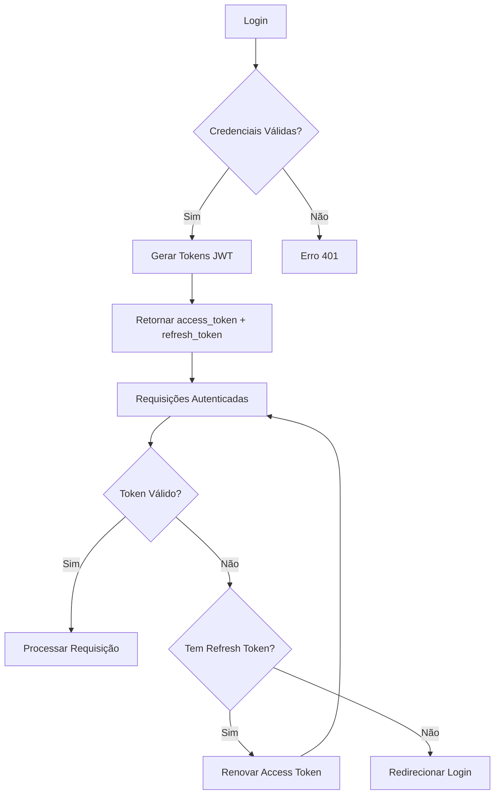

# 🔐 Sistema de Autenticação

O sistema de autenticação utiliza **JWT (JSON Web Tokens)** com refresh tokens para garantir segurança e flexibilidade.

## 🏗️ Arquitetura de Segurança

### Componentes

1. **Access Token**: Token de curta duração (15 min) para autenticação
2. **Refresh Token**: Token de longa duração (7 dias) para renovação
3. **Hash de Senhas**: bcrypt para proteção de credenciais
4. **Middleware JWT**: Validação automática de tokens

### Fluxo de Autenticação



## 🚀 Endpoints de Autenticação

### 📝 Registro de Usuário

```http
POST /auth/register
Content-Type: application/json

{
  "username": "novo_usuario",
  "email": "usuario@email.com",
  "password": "MinhaSenh@123",
  "confirm_password": "MinhaSenh@123"
}
```

**Resposta de Sucesso (201):**
```json
{
  "message": "Usuário criado com sucesso",
  "user": {
    "id": 2,
    "username": "novo_usuario",
    "email": "usuario@email.com",
    "is_admin": false,
    "is_active": true
  }
}
```

**Validações:**
- Username único (3-50 caracteres)
- Email válido e único
- Senha forte (mín. 8 caracteres, maiúscula, minúscula, número, especial)
- Confirmação de senha deve coincidir

### 🔑 Login

```http
POST /auth/login
Content-Type: application/json

{
  "email_or_username": "admin@pizzaria.com",
  "password": "Admin123!@#"
}
```

**Resposta de Sucesso (200):**
```json
{
  "access_token": "eyJhbGciOiJIUzI1NiIsInR5cCI6IkpXVCJ9...",
  "refresh_token": "eyJhbGciOiJIUzI1NiIsInR5cCI6IkpXVCJ9...",
  "token_type": "bearer",
  "expires_in": 900,
  "user": {
    "id": 1,
    "username": "admin",
    "email": "admin@pizzaria.com",
    "is_admin": true,
    "is_active": true
  }
}
```

### 🔄 Renovar Token

```http
POST /auth/refresh
Content-Type: application/json

{
  "refresh_token": "eyJhbGciOiJIUzI1NiIsInR5cCI6IkpXVCJ9..."
}
```

**Resposta de Sucesso (200):**
```json
{
  "access_token": "eyJhbGciOiJIUzI1NiIsInR5cCI6IkpXVCJ9...",
  "token_type": "bearer",
  "expires_in": 900
}
```

### 👑 Criar Administrador

!!! warning "Apenas Administradores"
    Este endpoint requer autenticação de administrador.

```http
POST /auth/create-admin
Authorization: Bearer <admin_access_token>
Content-Type: application/json

{
  "username": "novo_admin",
  "email": "admin@exemplo.com",
  "password": "AdminSenh@123",
  "confirm_password": "AdminSenh@123"
}
```

## 🛡️ Middleware de Segurança

### Validação JWT

O middleware verifica automaticamente:

1. **Presença do token**: Header Authorization obrigatório
2. **Formato válido**: Bearer token bem formado
3. **Assinatura**: Token assinado com chave secreta
4. **Expiração**: Token dentro da validade
5. **Usuário ativo**: Conta não desabilitada

### Headers Obrigatórios

```http
Authorization: Bearer <access_token>
```

### Rotas Protegidas

- ✅ **Públicas**: `/`, `/auth/login`, `/auth/register`, `/items/menu`
- 🔒 **Autenticadas**: `/users/me`, `/orders/*`, `/auth/refresh`
- 👑 **Administradores**: `/users/list`, `/items/create-item`, `/auth/create-admin`

## 🔐 Implementação Técnica

### Configuração JWT

```python
# config/security.py
SECRET_KEY = "sua_chave_secreta_super_segura"
ALGORITHM = "HS256"
ACCESS_TOKEN_EXPIRE_MINUTES = 15
REFRESH_TOKEN_EXPIRE_DAYS = 7
```

### Hash de Senhas

```python
from passlib.context import CryptContext

pwd_context = CryptContext(schemes=["bcrypt"], deprecated="auto")

def hash_password(password: str) -> str:
    return pwd_context.hash(password)

def verify_password(plain_password: str, hashed_password: str) -> bool:
    return pwd_context.verify(plain_password, hashed_password)
```

### Geração de Tokens

```python
def create_access_token(data: dict):
    to_encode = data.copy()
    expire = datetime.utcnow() + timedelta(minutes=ACCESS_TOKEN_EXPIRE_MINUTES)
    to_encode.update({"exp": expire, "type": "access"})
    return jwt.encode(to_encode, SECRET_KEY, algorithm=ALGORITHM)

def create_refresh_token(data: dict):
    to_encode = data.copy()
    expire = datetime.utcnow() + timedelta(days=REFRESH_TOKEN_EXPIRE_DAYS)
    to_encode.update({"exp": expire, "type": "refresh"})
    return jwt.encode(to_encode, SECRET_KEY, algorithm=ALGORITHM)
```

## 🚨 Tratamento de Erros

### Códigos de Erro Comuns

| Código | Erro | Descrição |
|--------|------|-----------|
| 400 | `INVALID_CREDENTIALS` | Email/senha incorretos |
| 401 | `TOKEN_EXPIRED` | Token expirado |
| 401 | `INVALID_TOKEN` | Token malformado |
| 403 | `INSUFFICIENT_PERMISSIONS` | Sem permissão de admin |
| 422 | `VALIDATION_ERROR` | Dados inválidos |

### Exemplo de Resposta de Erro

```json
{
  "detail": "Credenciais inválidas",
  "error_code": "INVALID_CREDENTIALS",
  "timestamp": "2023-01-01T12:00:00Z"
}
```

## 🔧 Configuração para Frontend

### Interceptor de Requisições (JavaScript)

```javascript
// Adicionar token a todas as requisições
axios.defaults.headers.common['Authorization'] = `Bearer ${accessToken}`;

// Interceptor para renovação automática
axios.interceptors.response.use(
  (response) => response,
  async (error) => {
    if (error.response?.status === 401 && refreshToken) {
      const newToken = await refreshAccessToken();
      if (newToken) {
        error.config.headers['Authorization'] = `Bearer ${newToken}`;
        return axios.request(error.config);
      }
    }
    return Promise.reject(error);
  }
);
```

### Armazenamento Seguro

```javascript
// Armazenar tokens com segurança
localStorage.setItem('access_token', accessToken);
localStorage.setItem('refresh_token', refreshToken);

// Ou usar cookies httpOnly para maior segurança
document.cookie = `refresh_token=${refreshToken}; httpOnly; secure; sameSite=strict`;
```

## 📋 Checklist de Segurança

- ✅ **Senhas hasheadas** com bcrypt
- ✅ **Tokens JWT** com expiração
- ✅ **Refresh tokens** para renovação
- ✅ **HTTPS** obrigatório em produção
- ✅ **Validação rigorosa** de entrada
- ✅ **Rate limiting** implementado
- ✅ **CORS** configurado corretamente
- ✅ **Headers de segurança** aplicados