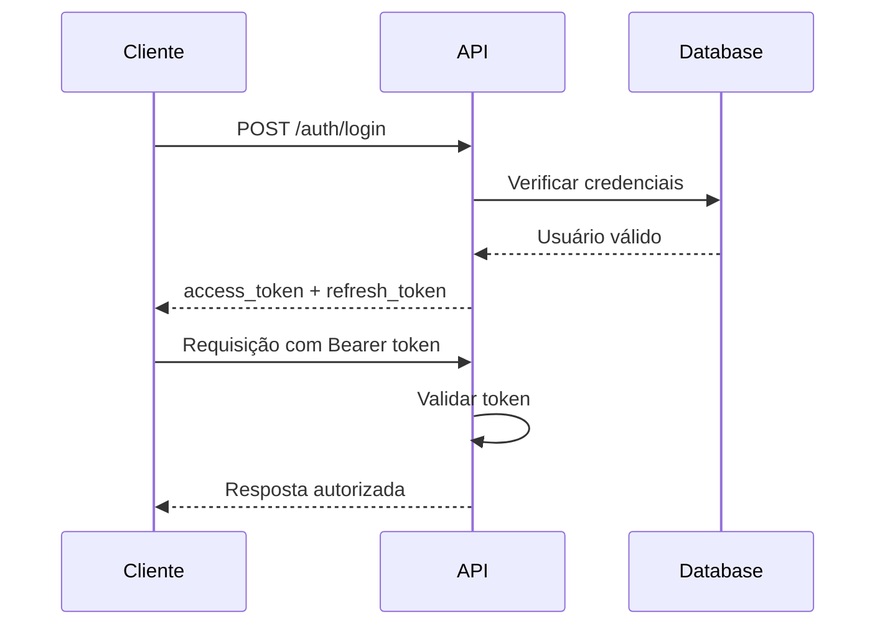

# 📋 Visão Geral da API

A API REST do Hashtag Pizzaria é construída com **FastAPI** e segue os padrões RESTful modernos.

## 🏗️ Arquitetura

### Estrutura de Pastas

```
backend/src/
├── config/          # Configurações
├── models/          # Modelos SQLAlchemy
├── routers/         # Endpoints da API
├── schemas/         # Validação Pydantic
├── utils/           # Utilitários
└── main.py          # Aplicação principal
```

### Tecnologias

- **FastAPI** - Framework web assíncrono
- **SQLAlchemy** - ORM para banco de dados
- **Pydantic** - Validação e serialização
- **PostgreSQL** - Banco de dados relacional
- **JWT** - Autenticação stateless

## 📊 Endpoints por Categoria

### 🔐 Autenticação (`/auth`)

| Método | Endpoint | Descrição |
|--------|----------|-----------|
| `POST` | `/auth/register` | Registro de usuário |
| `POST` | `/auth/login` | Login com JWT |
| `POST` | `/auth/refresh` | Renovar access token |
| `POST` | `/auth/create-admin` | Criar administrador |

### 👥 Usuários (`/users`)

| Método | Endpoint | Descrição |
|--------|----------|-----------|
| `GET` | `/users/me` | Perfil atual |
| `PUT` | `/users/me` | Atualizar perfil |
| `GET` | `/users/list` | Listar usuários (admin) |
| `PATCH` | `/users/{id}/admin` | Alterar status admin |

### 🍕 Cardápio (`/items`)

| Método | Endpoint | Descrição |
|--------|----------|-----------|
| `GET` | `/items/menu` | Cardápio público |
| `GET` | `/items/categories` | Categorias disponíveis |
| `POST` | `/items/create-item` | Criar item (admin) |
| `PUT` | `/items/edit-item/{id}` | Editar item (admin) |

### 🛒 Pedidos (`/orders`)

| Método | Endpoint | Descrição |
|--------|----------|-----------|
| `POST` | `/orders/create-order` | Criar pedido |
| `GET` | `/orders/my-orders` | Meus pedidos |
| `POST` | `/orders/{id}/add-item` | Adicionar item |
| `DELETE` | `/orders/{id}/remove-item` | Remover item |

## 🔒 Autenticação

A API utiliza **JWT (JSON Web Tokens)** para autenticação:

### Fluxo de Autenticação



### Tipos de Token

- **Access Token**: Válido por 15 minutos
- **Refresh Token**: Válido por 7 dias

### Headers Obrigatórios

```http
Authorization: Bearer <access_token>
Content-Type: application/json
```

## 📝 Modelos de Dados

### Usuario

```python
{
  "id": 1,
  "username": "admin",
  "email": "admin@pizzaria.com",
  "is_admin": true,
  "is_active": true,
  "created_at": "2023-01-01T00:00:00Z"
}
```

### Item do Cardápio

```python
{
  "id": 1,
  "name": "Pizza Margherita",
  "description": "Molho de tomate, mozzarella e manjericão",
  "price": 25.90,
  "category": "pizza",
  "image_url": null,
  "is_available": true
}
```

### Pedido

```python
{
  "id": 1,
  "user_id": 1,
  "status": "pendente",
  "total": 51.80,
  "estimated_time": 30,
  "created_at": "2023-01-01T12:00:00Z",
  "items": [...]
}
```

## 🚦 Códigos de Status

| Código | Descrição |
|--------|-----------|
| `200` | Sucesso |
| `201` | Criado com sucesso |
| `400` | Erro de validação |
| `401` | Não autorizado |
| `403` | Sem permissão |
| `404` | Não encontrado |
| `422` | Erro de dados |
| `500` | Erro interno |

## 🔍 Documentação Interativa

A API fornece documentação interativa através do Swagger UI:

- **Swagger UI**: `http://localhost:8000/docs`
- **ReDoc**: `http://localhost:8000/redoc`
- **OpenAPI Schema**: `http://localhost:8000/openapi.json`

## 📊 Monitoramento

### Health Check

```bash
GET /
```

Retorna o status da API e informações básicas do sistema.

### Métricas

A API registra automaticamente:

- Tempo de resposta
- Número de requisições
- Erros por endpoint
- Status de autenticação