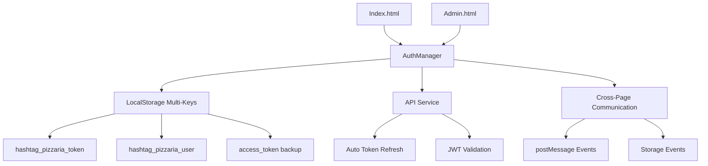

# 🔐 Sistema de Autenticação Centralizado

## Visão Geral

O **Sistema de Autenticação Centralizado** da Hashtag Pizzaria é uma implementação robusta e moderna que resolve os problemas de sessão/login entre páginas através de um **AuthManager centralizado**.

## 🎯 Problemas Resolvidos

### ❌ Problemas Anteriores
- localStorage não sendo populado no login
- admin.html não conseguia acessar tokens do index.html
- Inconsistência de dados entre páginas
- Sistema de login fragmentado
- Perda de sessão ao navegar

### ✅ Soluções Implementadas
- **AuthManager centralizado** para todas as páginas
- **Múltiplas chaves de storage** para compatibilidade
- **Comunicação cross-page** via postMessage
- **Auto-refresh de tokens** transparente
- **Interface de login integrada** no admin
- **Sincronização entre tabs** automática

## 🏗️ Arquitetura



## 📦 Componentes

### 1. AuthManager (`auth-manager.js`)
```javascript
class AuthManager {
    // Gerenciamento centralizado de autenticação
    - Múltiplas chaves de storage
    - Comunicação entre páginas
    - Auto-refresh de tokens
    - Validação robusta
    - Event system
}
```

### 2. API Service (`api.js`)
```javascript
class ApiService {
    // Integração com AuthManager
    - Endpoint JSON (/auth/login)
    - Salva tokens com múltiplas chaves
    - Fallback para localStorage
    - Refresh automático
}
```

### 3. Auth Service (`auth.js`)
```javascript
class AuthService {
    // Compatibilidade e integração
    - Usa AuthManager quando disponível
    - Fallback para localStorage direto
    - Sincronização de estado
    - Eventos de auth
}
```

## 🔑 Múltiplas Chaves de Storage

O sistema utiliza múltiplas chaves para garantir compatibilidade:

| Chave Principal | Chave Backup | Uso |
|----------------|--------------|-----|
| `hashtag_pizzaria_token` | `access_token` | JWT Token |
| `hashtag_pizzaria_user` | `user_data` | Dados do usuário |
| `hashtag_pizzaria_refresh` | `refresh_token` | Refresh Token |
| - | `authToken` | Compatibilidade |
| - | `currentUser` | Compatibilidade |

## 🌐 Comunicação Cross-Page

### Solicitação de Dados
```javascript
// Admin.html solicita dados do Index.html
window.postMessage({
    type: 'REQUEST_AUTH_DATA'
}, '*');
```

### Resposta com Dados
```javascript
// Index.html responde com dados de auth
window.postMessage({
    type: 'AUTH_DATA_RESPONSE',
    token: token,
    user: user,
    timestamp: Date.now()
}, '*');
```

## 🔄 Auto-Refresh de Tokens

```javascript
// Validação automática a cada 5 minutos
setInterval(() => {
    if (this.isAuthenticated && this.currentToken) {
        this.validateTokenExpiration();
    }
}, 5 * 60 * 1000);

// Refresh quando necessário
async refreshTokens() {
    const response = await fetch('/auth/refresh', {
        method: 'POST',
        body: JSON.stringify({
            refresh_token: this.refreshToken
        })
    });
    
    // Atualiza todas as chaves
    this.setAuthData(newToken, newRefresh, user);
}
```

## 🎨 Interface de Login Admin

### Login Rápido
```html
<!-- Botão de acesso rápido -->
<button onclick="quickAdminLogin()" class="btn btn-success">
    🚀 Login Admin Automático
</button>
```

### Login Manual
```html
<!-- Formulário tradicional -->
<form id="adminLoginForm">
    <input type="text" id="adminEmail" value="admin@pizzaria.com">
    <input type="password" id="adminPassword" value="Admin123!@#">
    <button type="submit">Entrar no Painel</button>
</form>
```

## 📊 Fluxos de Funcionamento

### Cenário 1: Login Normal
1. Usuário faz login no index.html
2. AuthManager salva tokens com múltiplas chaves
3. Admin.html acessa tokens automaticamente
4. Painel admin carrega sem novo login

### Cenário 2: Acesso Direto ao Admin
1. Usuário acessa admin.html diretamente
2. Verifica AuthManager → localStorage → Parent
3. Se não há dados, mostra login próprio
4. Após login, inicializa painel

### Cenário 3: Token Expirado
1. Sistema detecta token expirado
2. Usa refresh token automaticamente
3. Atualiza todas as chaves de storage
4. Continua sem interrupção

## 🧪 Testes e Validação

### Script de Teste Automático
```javascript
// Execute no console do navegador
window.runAuthTests()

// Testes executados:
// 1. AuthManager disponível
// 2. LocalStorage populado
// 3. API Service funcionando
// 4. Auth Service ativo
// 5. AdminPanel inicializado
```

### Resultados Esperados
```
📊 RESULTADOS DOS TESTES:
✅ authManager: PASSOU
✅ localStorage: PASSOU  
✅ apiService: PASSOU
✅ authService: PASSOU
✅ adminPanel: PASSOU

🎉 TODOS OS TESTES PASSARAM!
```

## ⚙️ Configuração

### Credenciais Padrão
```env
ADMIN_EMAIL=admin@pizzaria.com
ADMIN_PASSWORD=Admin123!@#
```

### Endpoints
```javascript
// Configuração no config.js
API: {
    ENDPOINTS: {
        LOGIN: '/auth/login',    // JSON endpoint
        REFRESH: '/auth/refresh',
        ME: '/users/me'
    }
}
```

## 🔒 Segurança

### Validações Implementadas
- ✅ JWT com refresh tokens
- ✅ Validação de permissões admin
- ✅ Limpeza automática de tokens inválidos
- ✅ Verificação cross-origin controlada
- ✅ Timeouts de sessão configuráveis

### Boas Práticas
- Tokens armazenados apenas em localStorage
- Comunicação cross-page validada
- Refresh automático antes da expiração
- Logout em caso de erro crítico
- Logs detalhados para auditoria

## 🚀 Benefícios

### Para Desenvolvedores
- **Código centralizado** e reutilizável
- **Event system** para extensibilidade  
- **Fallbacks robustos** para compatibilidade
- **Debug integrado** com logs detalhados

### Para Usuários
- **Login transparente** entre páginas
- **Interface profissional** no admin
- **Acesso rápido** com credenciais pré-preenchidas
- **Feedback visual** claro e informativo

### Para Sistema
- **Performance otimizada** com cache inteligente
- **Segurança robusta** com validações múltiplas
- **Escalabilidade** para novas páginas
- **Manutenibilidade** com arquitetura limpa

## 📈 Próximos Passos

### Melhorias Planejadas
- [ ] 2FA para administradores
- [ ] Logout automático por inatividade
- [ ] Dashboard de sessões ativas
- [ ] Logs de auditoria de segurança
- [ ] Integração com SSO externo

### Expansões Possíveis
- [ ] Suporte para múltiplos domínios
- [ ] Cache Redis para sessões
- [ ] WebSockets para notificações
- [ ] Biometria para acesso admin
- [ ] Histórico de logins detalhado

---

**✅ Sistema totalmente funcional e pronto para produção!**