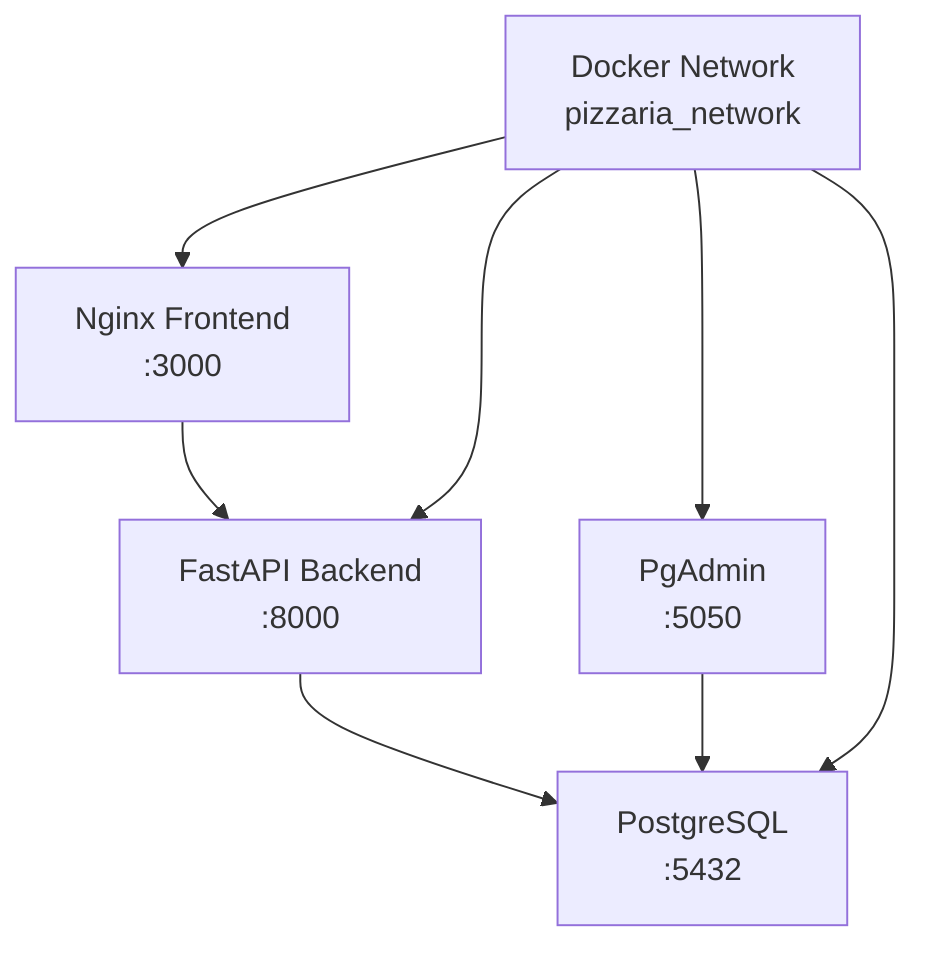

# 🐳 Configuração Docker

O sistema utiliza **Docker Compose** para orquestrar todos os serviços necessários, garantindo consistência entre ambientes.

## 📦 Arquitetura dos Containers



## 🏗️ Estrutura Docker

### Serviços

| Serviço | Container | Porta | Descrição |
|---------|-----------|-------|-----------|
| **Frontend** | `pizzaria_frontend` | 3000 | Interface web com Nginx |
| **Backend** | `pizzaria_backend` | 8000 | API FastAPI |
| **Database** | `pizzaria_postgres` | 5432 | PostgreSQL 15 |
| **PgAdmin** | `pizzaria_pgadmin` | 5050 | Admin do banco |

### Rede

```yaml
networks:
  pizzaria_network:
    driver: bridge
    ipam:
      config:
        - subnet: 172.18.0.0/16
```

## 📋 docker-compose.yml

```yaml
version: '3.8'

services:
  # PostgreSQL Database
  postgres:
    image: postgres:15-alpine
    container_name: pizzaria_postgres
    environment:
      POSTGRES_DB: ${DB_NAME:-pizzaria_db}
      POSTGRES_USER: ${DB_USER:-pizzaria_user}
      POSTGRES_PASSWORD: ${DB_PASSWORD:-pizzaria_pass}
    volumes:
      - postgres_data:/var/lib/postgresql/data
      - ./docker/init-scripts:/docker-entrypoint-initdb.d
    ports:
      - "5432:5432"
    networks:
      - pizzaria_network
    restart: unless-stopped
    healthcheck:
      test: ["CMD-SHELL", "pg_isready -U ${DB_USER:-pizzaria_user} -d ${DB_NAME:-pizzaria_db}"]
      interval: 10s
      timeout: 5s
      retries: 5

  # PgAdmin
  pgadmin:
    image: dpage/pgadmin4:latest
    container_name: pizzaria_pgadmin
    environment:
      PGADMIN_DEFAULT_EMAIL: ${PGADMIN_EMAIL:-admin@pizzaria.com}
      PGADMIN_DEFAULT_PASSWORD: ${PGADMIN_PASSWORD:-admin123}
      PGADMIN_CONFIG_SERVER_MODE: 'False'
    volumes:
      - pgadmin_data:/var/lib/pgadmin
    ports:
      - "5050:80"
    networks:
      - pizzaria_network
    depends_on:
      postgres:
        condition: service_healthy
    restart: unless-stopped

  # FastAPI Backend
  backend:
    build:
      context: .
      dockerfile: docker/Dockerfile.backend
    container_name: pizzaria_backend
    environment:
      - DATABASE_URL=postgresql://${DB_USER:-pizzaria_user}:${DB_PASSWORD:-pizzaria_pass}@postgres:5432/${DB_NAME:-pizzaria_db}
      - SECRET_KEY=${SECRET_KEY:-dev-secret-key-change-in-production}
      - DEBUG=${DEBUG:-True}
    volumes:
      - ./backend:/app
    ports:
      - "8000:8000"
    networks:
      - pizzaria_network
    depends_on:
      postgres:
        condition: service_healthy
    restart: unless-stopped
    command: uvicorn src.main:app --host 0.0.0.0 --port 8000 --reload

  # Nginx Frontend
  frontend:
    build:
      context: .
      dockerfile: docker/Dockerfile.frontend
    container_name: pizzaria_frontend
    volumes:
      - ./frontend:/usr/share/nginx/html
      - ./docker/nginx.conf:/etc/nginx/nginx.conf
    ports:
      - "3000:80"
    networks:
      - pizzaria_network
    depends_on:
      - backend
    restart: unless-stopped

volumes:
  postgres_data:
  pgadmin_data:

networks:
  pizzaria_network:
    driver: bridge
```

## 🐳 Dockerfiles

### Backend (Dockerfile.backend)

```dockerfile
FROM python:3.12-slim

WORKDIR /app

# Install system dependencies
RUN apt-get update && apt-get install -y \
    gcc \
    postgresql-client \
    && rm -rf /var/lib/apt/lists/*

# Install Python dependencies
COPY backend/pyproject.toml backend/poetry.lock* ./
RUN curl -sSL https://install.python-poetry.org | python3 - || pip install poetry
RUN poetry config virtualenvs.create false
RUN poetry install --no-dev

# Copy application code
COPY backend/ .

# Create non-root user
RUN useradd --create-home --shell /bin/bash app \
    && chown -R app:app /app
USER app

# Health check
HEALTHCHECK --interval=30s --timeout=30s --start-period=5s --retries=3 \
  CMD curl -f http://localhost:8000/ || exit 1

EXPOSE 8000

CMD ["uvicorn", "src.main:app", "--host", "0.0.0.0", "--port", "8000"]
```

### Frontend (Dockerfile.frontend)

```dockerfile
FROM nginx:alpine

# Copy custom nginx configuration
COPY docker/nginx.conf /etc/nginx/nginx.conf

# Copy static files
COPY frontend/ /usr/share/nginx/html/

# Create nginx user and set permissions
RUN chown -R nginx:nginx /usr/share/nginx/html \
    && chmod -R 755 /usr/share/nginx/html

# Health check
HEALTHCHECK --interval=30s --timeout=3s --start-period=5s --retries=3 \
  CMD curl -f http://localhost/ || exit 1

EXPOSE 80

CMD ["nginx", "-g", "daemon off;"]
```

## ⚙️ Configuração Nginx

### nginx.conf

```nginx
events {
    worker_connections 1024;
}

http {
    include       /etc/nginx/mime.types;
    default_type  application/octet-stream;
    
    # Logging
    log_format main '$remote_addr - $remote_user [$time_local] "$request" '
                   '$status $body_bytes_sent "$http_referer" '
                   '"$http_user_agent" "$http_x_forwarded_for"';
    
    access_log /var/log/nginx/access.log main;
    error_log /var/log/nginx/error.log warn;
    
    # Performance
    sendfile on;
    tcp_nopush on;
    tcp_nodelay on;
    keepalive_timeout 65;
    types_hash_max_size 2048;
    
    # Gzip compression
    gzip on;
    gzip_vary on;
    gzip_min_length 1024;
    gzip_proxied any;
    gzip_comp_level 6;
    gzip_types
        text/plain
        text/css
        text/xml
        text/javascript
        application/json
        application/javascript
        application/xml+rss
        application/atom+xml
        image/svg+xml;

    server {
        listen 80;
        server_name localhost;
        root /usr/share/nginx/html;
        index index.html;
        
        # Security headers
        add_header X-Frame-Options DENY;
        add_header X-Content-Type-Options nosniff;
        add_header X-XSS-Protection "1; mode=block";
        add_header Referrer-Policy strict-origin-when-cross-origin;
        
        # Static files with cache
        location ~* \.(css|js|png|jpg|jpeg|gif|ico|svg|woff|woff2|ttf|eot)$ {
            expires 1y;
            add_header Cache-Control "public, immutable";
        }
        
        # HTML files without cache
        location ~* \.html$ {
            expires -1;
            add_header Cache-Control "no-cache, no-store, must-revalidate";
        }
        
        # API proxy
        location /api/ {
            proxy_pass http://backend:8000/;
            proxy_set_header Host $host;
            proxy_set_header X-Real-IP $remote_addr;
            proxy_set_header X-Forwarded-For $proxy_add_x_forwarded_for;
            proxy_set_header X-Forwarded-Proto $scheme;
        }
        
        # SPA fallback
        location / {
            try_files $uri $uri/ /index.html;
        }
        
        # Health check
        location /health {
            access_log off;
            return 200 "healthy\n";
        }
    }
}
```

## 🔧 Variáveis de Ambiente

### .env

```bash
# Database
DB_NAME=pizzaria_db
DB_USER=pizzaria_user
DB_PASSWORD=pizzaria_pass
DB_HOST=postgres
DB_PORT=5432

# PgAdmin
PGADMIN_EMAIL=admin@pizzaria.com
PGADMIN_PASSWORD=admin123

# Backend
SECRET_KEY=your-super-secret-jwt-key-here
DEBUG=True
ENVIRONMENT=development

# Admin user
ADMIN_EMAIL=admin@pizzaria.com
ADMIN_PASSWORD=Admin123!@#
```

### .env.production

```bash
# Production settings
DB_NAME=pizzaria_prod
DB_USER=pizzaria_prod_user
DB_PASSWORD=super-secure-password
DB_HOST=db.example.com
DB_PORT=5432

SECRET_KEY=production-jwt-secret-key-256-bits
DEBUG=False
ENVIRONMENT=production

ADMIN_EMAIL=admin@example.com
ADMIN_PASSWORD=ProductionAdminPassword123!
```

## 🚀 Comandos Docker

### Desenvolvimento

```bash
# Iniciar todos os serviços
docker compose up -d

# Visualizar logs
docker compose logs -f

# Parar serviços
docker compose down

# Rebuild containers
docker compose up --build

# Executar comando no backend
docker compose exec backend bash

# Backup do banco
docker compose exec postgres pg_dump -U pizzaria_user pizzaria_db > backup.sql
```

### Scripts Automatizados

```bash
# Setup inicial
./scripts/setup.sh

# Comandos do dia a dia
./scripts/dev-commands.sh start
./scripts/dev-commands.sh stop
./scripts/dev-commands.sh restart
./scripts/dev-commands.sh logs
./scripts/dev-commands.sh clean
```

## 📊 Monitoramento

### Health Checks

Todos os containers incluem health checks:

```bash
# Verificar status dos containers
docker compose ps

# Status específico
docker inspect --format='{{.State.Health.Status}}' pizzaria_backend
```

### Logs Centralizados

```bash
# Logs de todos os serviços
docker compose logs -f

# Logs específicos
docker compose logs -f backend
docker compose logs -f postgres

# Logs com timestamp
docker compose logs -f -t
```

### Métricas de Performance

```bash
# Uso de recursos
docker stats

# Uso de disco
docker system df

# Cleanup automático
docker system prune -f
```

## 🔒 Segurança

### Network Isolation

```yaml
networks:
  pizzaria_network:
    driver: bridge
    internal: true  # Apenas comunicação interna
```

### Secrets Management

```yaml
secrets:
  db_password:
    file: ./secrets/db_password.txt
  jwt_secret:
    file: ./secrets/jwt_secret.txt

services:
  backend:
    secrets:
      - db_password
      - jwt_secret
```

### Production Security

```dockerfile
# Remove development tools
RUN apt-get remove -y gcc \
    && apt-get autoremove -y \
    && apt-get clean

# Non-root user
USER app

# Read-only filesystem
--read-only
--tmpfs /tmp
```

## 🔄 CI/CD Integration

### GitHub Actions

```yaml
name: Deploy
on:
  push:
    branches: [main]

jobs:
  deploy:
    runs-on: ubuntu-latest
    steps:
      - uses: actions/checkout@v3
      
      - name: Deploy to Production
        run: |
          docker compose -f docker-compose.prod.yml up -d --build
          docker compose exec backend alembic upgrade head
```

### Docker Registry

```bash
# Tag and push
docker tag pizzaria_backend registry.example.com/pizzaria/backend:latest
docker push registry.example.com/pizzaria/backend:latest

# Deploy from registry
docker compose pull
docker compose up -d
```