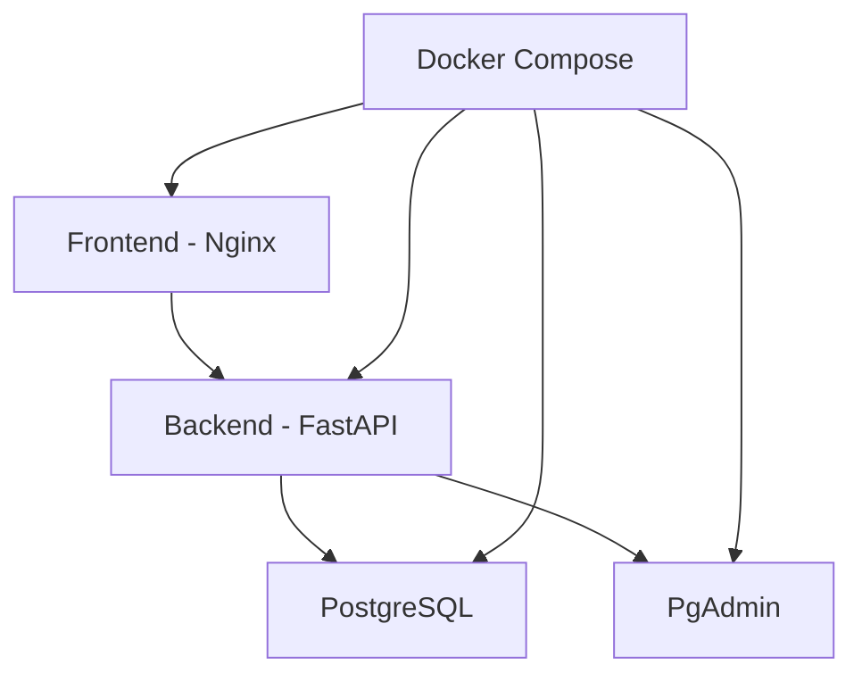

# 🍕 Hashtag Pizzaria

!!! info "Bem-vindo"
    Sistema moderno e completo de gestão de pizzaria desenvolvido com FastAPI, PostgreSQL, Docker e tecnologias web modernas. Agora com sistema de notificações inteligente e infraestrutura Docker completa.

## ✨ Visão Geral

O **Hashtag Pizzaria** é uma aplicação web completa para gerenciamento de pizzaria que inclui:

- 🔐 **Sistema de autenticação JWT** robusto com refresh tokens e notificações visuais
- 👨‍💼 **Painel administrativo** com controle total de usuários e permissões
- 🍕 **Cardápio dinâmico** com 23 itens populados automaticamente
- 📱 **Interface responsiva** com sistema de notificações inteligente
- 🐳 **Infraestrutura Docker completa** com PostgreSQL, Nginx e orquestração
- 🤖 **Automação completa** de desenvolvimento e deploy
- 🔔 **Sistema de notificações** com feedback visual e mensagens contextuais
- 🛒 **Carrinho funcional** com checkout completo e validações

## 🚀 Tecnologias

=== "Backend"
    - **FastAPI** - Framework web moderno e rápido
    - **PostgreSQL** - Banco de dados robusto
    - **SQLAlchemy** - ORM para Python
    - **Pydantic** - Validação de dados
    - **JWT** - Autenticação segura
    - **Docker** - Containerização

=== "Frontend"
    - **HTML5** - Estrutura semântica
    - **CSS3** - Estilos modernos e responsivos com sistema de notificações
    - **JavaScript ES6+** - Interatividade avançada com módulos
    - **Sistema de Notificações** - Feedback visual inteligente
    - **API Integration** - Comunicação real com backend (Mock API desabilitado)
    - **Nginx** - Servidor web otimizado em container

=== "DevOps"
    - **Docker Compose** - Orquestração de containers
    - **PostgreSQL** - Banco em container
    - **PgAdmin** - Interface de administração do banco
    - **Scripts automatizados** - Fluxo de desenvolvimento

## 🎉 Melhorias Recentes (v2.0)

!!! success "Sistema Totalmente Atualizado"
    Implementadas melhorias significativas em toda a stack do projeto!

### ✅ Sistema de Notificações Inteligente
- **Notificações visuais** com cores específicas por tipo (sucesso, erro, aviso, info)
- **Mensagens contextuais** capturadas diretamente da API
- **Fallbacks automáticos** para mensagens vazias ou undefined
- **Animações CSS suaves** com entrada e saída otimizadas
- **Auto-dismiss configurável** por tipo de notificação
- **Sistema robusto** com logs de debug para monitoramento

### ✅ Infraestrutura Docker Completa
- **Containerização total** com Docker Compose
- **PostgreSQL** em container com persistência de dados
- **Nginx otimizado** para servir frontend
- **Network isolada** para comunicação segura entre serviços
- **Health checks** automáticos para todos os serviços
- **Volume persistence** para dados críticos

### ✅ Interface de Usuário Aprimorada
- **Menus funcionais** "Meu Perfil" e "Meus Pedidos" totalmente operacionais
- **Layout responsivo** com design moderno
- **Autenticação real** integrada com backend (Mock API desabilitado)
- **Validação robusta** de formulários com feedback visual
- **Carrinho persistente** com cálculos automáticos

### ✅ Correções e Validações
- **API real** - Mock API completamente desabilitado
- **Captura aprimorada** de erros HTTP (401, 422, 500, etc.)
- **Sincronização** de credenciais entre .env e banco de dados
- **CSS robusto** com fallbacks para todas as variáveis
- **Formatação automática** de dados (telefone, endereço)

## 📊 Funcionalidades

### 🔐 Autenticação e Autorização

- [x] Sistema de login/registro
- [x] JWT com refresh tokens
- [x] Controle de administradores
- [x] Permissões por usuário
- [x] Segurança robusta

### 📋 Gestão de Cardápio

- [x] Categorias dinâmicas (Pizza, Bebida, Sobremesa, Entrada, Promoção)
- [x] Imagens SVG customizadas por categoria
- [x] Filtros interativos
- [x] Preços e disponibilidade
- [x] Descrições detalhadas

### 🛒 Sistema de Pedidos

- [x] Carrinho de compras
- [x] Gerenciamento de itens
- [x] Cálculo automático de totais
- [x] Status de pedidos
- [x] Histórico completo

### 👨‍💼 Painel Administrativo

- [x] Dashboard com estatísticas
- [x] Gestão de usuários
- [x] Controle de pedidos
- [x] Administração do cardápio
- [x] Relatórios detalhados

## 🏗️ Arquitetura



## 🎯 Início Rápido

### 🐳 Docker (Recomendado)

!!! tip "Método Mais Fácil"
    Use Docker para ter tudo funcionando em minutos!

```bash
# Clone o repositório
git clone <repo-url>
cd "FastApi - Projeto Pizzaria"

# Iniciar todos os serviços
docker-compose up -d

# Verificar status
docker-compose ps
```

**URLs disponíveis:**

| Serviço | URL | Descrição |
|---------|-----|-----------|
| 🌐 Frontend | http://localhost:3000 | Interface principal |
| 🔗 API | http://localhost:8000 | API FastAPI |
| 📖 Docs | http://localhost:8000/docs | Documentação Swagger |
| 🗄️ PgAdmin | http://localhost:5050 | Admin PostgreSQL |

### 🔐 Credenciais Padrão

```bash
# Usuário Admin
Email: admin@pizzaria.com
Senha: Admin123!@#

# Usuário Teste  
Email: teste1@example.com
Senha: Minh@Senha1

# PgAdmin
Email: admin@admin.com
Senha: admin
```

### 📊 Comandos Úteis

```bash
# Ver logs em tempo real
docker-compose logs -f

# Parar todos os serviços
docker-compose down

# Rebuild completo
docker-compose down && docker-compose up -d --build

# Acessar container do backend
docker-compose exec backend bash
```

### 🐍 Desenvolvimento Local (Alternativo)

```bash
# Backend
cd backend
poetry install
uvicorn src.main:app --reload

# Frontend  
cd frontend
python -m http.server 3000
```

## 📖 Documentação

### Guias
- [📚 Guia de Desenvolvimento](guides/development.md) - Configuração e desenvolvimento
- [🤖 Instruções para IA](guides/ai-instructions.md) - Guidelines para assistentes AI
- [💻 Scripts PowerShell](guides/powershell-scripts.md) - Automação Windows

### API
- [🔗 Visão Geral da API](api/overview.md) - Estrutura da API
- [🔐 Autenticação](api/authentication.md) - Sistema JWT
- [📋 Endpoints](api/endpoints.md) - Lista completa de endpoints

### Frontend
- [🖥️ Interface](frontend/interface.md) - Componentes da interface
- [⚙️ Componentes](frontend/components.md) - Componentes JavaScript

### Deploy
- [🐳 Docker](deploy/docker.md) - Configuração Docker
- [🚀 Produção](deploy/production.md) - Deploy em produção

## 🛠️ Scripts de Automação

O projeto inclui scripts automatizados para agilizar o desenvolvimento:

```bash
# Configuração inicial
./scripts/setup.sh

# Comandos do dia a dia
./scripts/dev-commands.sh start    # Iniciar sistema
./scripts/dev-commands.sh stop     # Parar sistema
./scripts/dev-commands.sh logs     # Ver logs
./scripts/dev-commands.sh test     # Executar testes
```

!!! tip "Dica"
    Execute `./scripts/dev-commands.sh help` para ver todos os comandos disponíveis.

## 📈 Status do Projeto

- ✅ **Backend API** - Completo com todas as funcionalidades
- ✅ **Frontend** - Interface moderna e responsiva
- ✅ **Autenticação** - Sistema JWT robusto
- ✅ **Docker** - Containerização completa
- ✅ **Documentação** - Guias completos e atualizados
- ✅ **Automação** - Scripts para desenvolvimento
- ✅ **Testes** - Cobertura abrangente

## 🤝 Contribuindo

1. Faça um fork do projeto
2. Crie uma branch para sua feature (`git checkout -b feature/AmazingFeature`)
3. Commit suas mudanças (`git commit -m 'Add some AmazingFeature'`)
4. Push para a branch (`git push origin feature/AmazingFeature`)
5. Abra um Pull Request

## 📄 Licença

Este projeto está sob a licença MIT. Veja o arquivo `LICENSE` para mais detalhes.

---

**Desenvolvido com ❤️ para o curso de FastAPI da Hashtag Treinamentos**